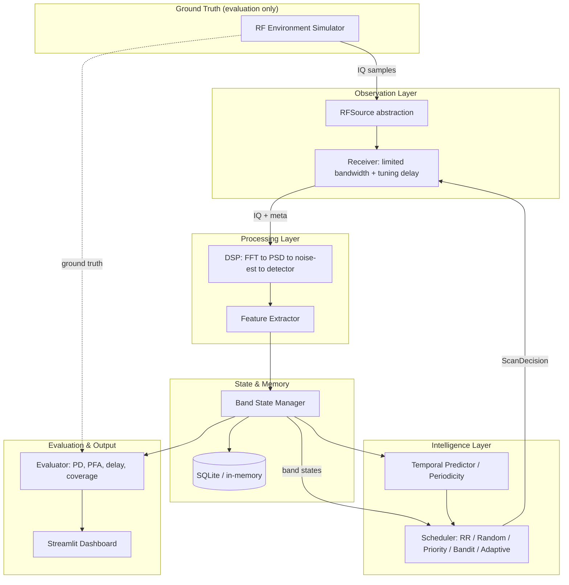

# Smart Adaptive Spectrum Scan & Signal Monitoring System

A complete, locally-runnable system for **adaptive scanning of a wide RF spectrum**
when there is little or no prior information about signal activity. A receiver whose
instantaneous bandwidth (e.g. 20 MHz) is far smaller than the total monitored
spectrum (e.g. 1000 MHz) must intelligently decide **where to look next**, balancing
exploration of unknown bands against exploitation of historically active ones.

Everything after acquisition is genuinely implemented: IQ ingestion, FFT/PSD,
noise estimation, energy detection, feature extraction, band-state tracking,
activity prediction, adaptive scheduling, online learning, evaluation, and a
dashboard. **No hardware is required** — the RF environment is simulated (or replayed
from recorded IQ files), and a real authorized receiver can be plugged in later via
the `RFSource` hardware-abstraction layer without touching the DSP, ML, or
scheduling code.

> **The detector never sees ground truth.** The scheduler infers activity purely
> from what it measures. Ground truth is available *only* to the evaluation
> subsystem, and automated tests enforce this separation.

---

## 0. Electronic Warfare framing

This is a **machine-learning Electronic Support (ES) receiver scheduler**. An ES
sensor has high sensitivity but an instantaneous bandwidth an order of magnitude
smaller than the spectrum it must guard, so it has to *sweep* — a two-dimensional
(frequency × time) search. Open-loop, pre-mission sweep plans waste time on
non-threatening emitters; the goal here is a **closed-loop, learning** scheduler
that minimises **intercept time** and maximises **interception rate** against
periodic, frequency-agile, and spatially-scanning (rotating-antenna) emitters,
trained online from **hits and misses**.

| EW term | In this repo |
|---|---|
| ES receiver / dwell / revisit | `Receiver` (limited BW + tuning delay) + `ScanDecision` |
| Emitter truth per band per time slot | `RFEnvironment` / `PDWEnvironment` ground truth |
| Spatially-scanning radar | `radar_scan` emitter (rotating-beam illumination) |
| Frequency-agile emitter | `frequency_hopping` / agile `radar_scan` |
| Intercept time / interception ratio | discovery delay / activity discovery ratio |
| Avg intercept rate | scan hit rate |
| Probability of detection / false alarm | PD / PFA |
| Sensitivity | `scripts/sensitivity_sweep.py` (PD vs SNR) |
| % correct predictions | `prediction_accuracy` |
| Avg intercept time error | `avg_intercept_time_error` |
| Robust ML scheduler trained on hits/misses | `adaptive` (LinUCB) + bandits |

**Radar ESM result (synthetic PDWs, 6 rotating radars, 1500 scans, seed 1):** learning
schedulers intercept **≈9× more per scan** than a blind round-robin sweep — `bandit_ucb`
hit-rate **0.199** vs round-robin **0.021**. Measuring *distinct* illuminations
intercepted exposes the real trade-off: a blind sweep stumbles onto more one-off
flashes across the whole span (round-robin and Thompson both reach **0.65** distinct),
while the learners lock onto and re-intercept active emitters far more efficiently —
`adaptive` posts the **fastest average intercept, 56 ms** (vs 136 ms for round-robin).
Reproduce with `python scripts/pdw_experiment.py --compare`. (The
`activity_discovery_ratio` counts **distinct** ground-truth events, not per-scan true
positives.)

---

## 1. Architecture



The **only** bridge across the information wall is `RFSource.read_samples()`, which
returns raw complex IQ and acquisition metadata — never labels.

---

## 2. Installation

Requires **Python 3.12+**.

```bash
cd smart-spectrum-scan
python3 -m venv .venv
source .venv/bin/activate        # Windows: .venv\Scripts\activate
pip install -e ".[dev]"
```

Or, without the editable install:

```bash
pip install -r requirements.txt
export PYTHONPATH=src             # so `import smartscan` works
```

---

## 3. Quick start

Run one scheduler against one scenario:

```bash
python scripts/run_experiment.py --scheduler adaptive --scenario periodic
python scripts/run_experiment.py --scheduler round_robin --scenario sparse --num-bands 100 --steps 1500
```

Benchmark every scheduler against every scenario (fair, seed-matched):

```bash
python scripts/benchmark_schedulers.py --num-bands 60 --steps 800 --seeds 1 2 3
```

Radar ESM intercept on pulse (PDW) data, and a detector sensitivity sweep:

```bash
python scripts/pdw_experiment.py --compare --steps 1500     # rotating radars
python scripts/sensitivity_sweep.py                         # PD vs SNR
```

Generate a recorded IQ dataset and confirm the same pipeline replays it:

```bash
python scripts/generate_dataset.py --scenario periodic --duration 2.0
```

Launch the dashboard:

```bash
streamlit run dashboard/app.py
```

Select **Phone Link** in the dashboard sidebar to monitor a paired Android
phone, iPhone, or other Bluetooth device. On macOS the page reads connection
state and RSSI from local system telemetry, keeps a rolling signal-strength
graph, and exports the session as CSV. Because macOS does not expose RSSI for
every phone connection type, the page also provides a clearly labelled
presentation mode when a live value is unavailable.

Phone Link uses a 100 ms display refresh with honest sample-age reporting and
an adjustable 0.1-5 second intake interval for browser heartbeats, Bluetooth
polling, and the demo source. It
automatically resumes the last locally selected phone, and keeps the contact
trace inside the dedicated Phone Link workspace. At 80% quality it enters a
yellow caution state; after two consecutive samples above 90% it replaces the
normal console with an isolated red **War Mode** training interface. War Mode
shows the live signal at the top right, derives motion and confidence from the
rolling observation history, and applies the configured demo identity rule:
phones represent fighter aircraft and AirPods represent drone formations. Its
track-lock, containment, handoff, and neutralisation controls create local
simulation records only; they do not transmit or control a device. Audible alerts are
operator-armed and can be silenced. Press **ARM AUDIO** once after opening the
dashboard; this user gesture satisfies Safari and Chrome autoplay rules, after
which caution and War Mode transitions sound automatically. A phone-driven
simulation converts the current link quality into the SNR of a synthetic target
emitter, then runs that signal through the existing IQ, detector, scheduler,
and evaluator pipeline.

For reliable iPhone and Android demonstrations, choose **Phone browser link**
and open the displayed local address on the phone while both devices use the
same network. Try each displayed LAN address if the first is unavailable, then
use **TEST LOCAL LINK SERVICE** to separate a server problem from a Wi-Fi or
firewall problem. The phone page sends a heartbeat at the selected intake rate and measures transport
latency, jitter, freshness, and link quality. It is labelled as a network-link
measurement rather than Bluetooth RSSI. **Mac Bluetooth RSSI** remains available
for devices and macOS versions that expose real RSSI telemetry.

---

## 4. How it works, step by step

Each scan step of the online loop:

1. **Scheduler decides** — picks a band from `BandState`s (observation-derived only)
   and emits a `ScanDecision(band_id, center_frequency, bandwidth, dwell_time, …)`.
2. **Receiver observes** — tunes (incurring `tuning_delay`), dwells (`dwell_time`),
   and returns complex IQ + `AcquisitionMeta`. Bandwidth is clamped to the receiver's
   instantaneous limit. The simulation clock advances.
3. **DSP + detection** — window → FFT → PSD (Welch/periodogram) → robust noise-floor
   estimate → adaptive threshold (`noise + margin`) → energy detection.
4. **State update** — the detection becomes a `BandObservation`; hit/miss counts,
   EWMA activity, running SNR, and confidence update.
5. **Reward + learning** — reward is computed from the **detection outcome** (not
   ground truth), and the scheduler updates online.
6. **Evaluation annotation** — *separately*, the evaluator queries ground truth to
   score the scan. This path never touches the scheduler.

---

## 5. Schedulers

| Scheduler | Idea |
|-----------|------|
| `round_robin` | Sequential sweep B0→B1→…→BN→B0 |
| `random` | Uniform random band selection |
| `priority` | `activity·w1 + recency·w2 + uncertainty·w3`, with anti-starvation |
| `bandit_ucb` | UCB1: mean reward + `c·√(ln N / n)` exploration bonus |
| `bandit_thompson` | Beta-Bernoulli Thompson Sampling |
| `adaptive` | **Contextual bandit (shared LinUCB)** over per-band feature vectors, plus periodicity-aware revisit bonus |
| `q_learning` | **Reinforcement learning** — tabular contextual Q-learning with discounted (multi-step) return; beats the open-loop baselines on persistent activity, and a neural DQN is the natural extension |

### Detectors (selectable via `detector.detector_type`)

| Detector | Idea |
|----------|------|
| `energy` | PSD vs adaptive threshold (default) |
| `matched_filter` | coherent single-FFT **peak-bin** detector with CFAR correction — keeps full processing gain for narrowband emitters |
| `cyclostationary` | **cyclic-autocorrelation** feature detector — exploits signal correlation to catch structured signals and reject white noise |

The adaptive scheduler learns a linear map from each band's feature context
(activity ratio, recency, confidence, SNR, …) to expected reward, so it generalizes
across bands and makes informed guesses about rarely-visited ones.

---

## 6. Metrics (definitions)

| Metric | Definition |
|--------|-----------|
| **PD** | correctly detected active opportunities / total active opportunities |
| **PFA** | false detections / inactive opportunities |
| **Scan hit rate** | scans with a detection / total scans |
| **Activity discovery ratio** | distinct activity events discovered / total events |
| **Avg / median / p95 discovery delay** | `detection_time − activity_start_time` |
| **Scan efficiency** | useful (true-positive) observations / total observations |
| **Band coverage** | bands visited at least once / total bands |
| **Starvation rate** | fraction of bands whose max revisit gap exceeds a threshold |
| **Precision / Recall / F1** | detector quality vs ground truth |
| **Average reward** | mean per-scan reward (detection-driven) |
| **Prediction accuracy** | % of scans whose pre-scan activity belief matched truth |
| **Avg intercept-time error** | mean \|predicted − actual\| next-activity time (periodicity) |
| **Sensitivity** | PD vs SNR sweep — `scripts/sensitivity_sweep.py` |

The system carefully distinguishes **detector performance** (PD, PFA, F1) from
**scheduler performance** (discovery delay, efficiency, coverage, starvation).

---

## 7. Scenarios

`sparse`, `dense`, `periodic`, `random_burst`, `frequency_hopping`, `changing`
(statistics shift midway), `low_snr`, `mixed`, and **`radar_scan`** (rotating-antenna
search radars, some frequency-agile — the classic ES intercept problem). All are
reproducible from a seed and used identically across schedulers for fair comparison.

---

## 8. Reproducible evaluation

The adaptive policy now uses a hard maximum revisit gap, a minimum exploration
budget, observation-only temporal belief fusion, threat/novelty/coverage utility,
variable dwell, and explicit revisit recommendations. Older numeric tables are no
longer presented as current evidence because they predate this policy and their
checked-in raw artifact covered only 144 of the later documented 189 runs.

Generate the authoritative campaign from the current revision with:

```bash
python scripts/benchmark_schedulers.py --num-bands 60 --steps 800 --seeds 1 2 3
```

The command now writes raw results, summaries, bootstrap confidence intervals,
paired adaptive-versus-round-robin differences, a Pareto table, and a JSON manifest
containing the exact configuration, Python version, Git revision, command, run count,
and SHA-256 digest of every artifact. Do not publish a benchmark table without its
matching manifest.

The evaluator reports both delay among intercepted events and **mission-censored
intercept time**, where missed events contribute their remaining time to mission end.
This prevents a scheduler that finds only a few easy events from appearing fast.

## 9. Recorded IQ files

Format: raw **complex64** binary (interleaved float32 I/Q) plus a JSON sidecar:

```json
{ "sample_rate": 20000000.0, "center_frequency": 100000000.0, "start_time": 0.0 }
```

`RecordedIQSource` reads these and feeds the **identical** DSP pipeline used for
simulated samples. Generate one with `scripts/generate_dataset.py`, then run the
full online loop against it via the recorded-file entry point:

```bash
python scripts/generate_dataset.py --scenario periodic --duration 2.0 --center 730e6
python scripts/recorded_experiment.py --iq data/recordings/periodic.c64 --scheduler adaptive
```

`build_and_run_recorded()` mirrors `build_and_run()`. Real recordings have no
labels, so truth-based metrics (PD / PFA / intercept ratio / delay) are reported as
0; detection-side metrics (hit rate, coverage, prediction accuracy, reward) are real.

**Other optional runtime components (all now wired in):**
- **Online ML predictor** — pass `use_ml_predictor=True` to `build_and_run(...)` to
  drive the pre-scan activity belief with the logistic-SGD `MLActivityPredictor`
  instead of the band's EWMA.
- **SQLite persistence** — set `database.backend: sqlite` (and `sqlite_path`) in the
  config and every run's final band states + observation history are written to disk.
- **`simulation.duration`** — set it to make the step count derive from a fixed
  mission duration; leave unset to use the selected scenario's own duration.
- **`FeatureExtractor`** runs every scan step, populating `artifacts.band_features`.

---

## 9b. Radar ESM / PDW data (Turing dataset)

Radar ESM datasets ship as **Pulse Descriptor Words** (one row per pulse: time of
arrival, RF frequency, pulse width, angle of arrival, amplitude, emitter label) —
e.g. the Alan Turing Institute's *Turing Synthetic Radar Dataset* (its **Scan Mode**
is a realistic frequency-sweeping receiver, directly matching this problem).

`smartscan.simulation.pdw` turns a PDW table into a `PDWEnvironment` that answers
*transmission / non-transmission per band per time slot* and synthesises IQ, so the
**same** detector → scheduler → evaluator pipeline runs on pulse data unchanged.

```bash
# seeded synthetic radars (no download needed) — compare all schedulers
python scripts/pdw_experiment.py --compare --steps 1500

# your own PDW export (Turing Scan Mode, or any CSV with
#   toa, frequency, pulse_width, amplitude, emitter_id  — aliases accepted)
python scripts/pdw_experiment.py --pdw-csv data/recordings/turing_scan.csv --scheduler adaptive

# full CAMPAIGN — every scheduler across many pulse trains, averaged + saved to CSV
python scripts/pdw_campaign.py --seeds 1 2 3 --steps 1500
python scripts/pdw_campaign.py --pdw-dir data/recordings/turing_scan/   # a folder of real Turing CSVs
```

To use the real Turing data: export a Scan-Mode pulse train to CSV with those
columns (a full 70 GB download is **not** required — a single pulse train works),
then point `--pdw-csv` at it. Note the Turing *challenge* task is pulse
**deinterleaving** (clustering pulses by emitter); we consume the same PDWs for the
sibling task of **scan scheduling / intercept**.

---

## 10. Future receiver abstraction

`RFSource` defines `read_samples / tune / get_sample_rate / get_center_frequency /
get_time`. Implementations: `SimulatedRFSource`, `RecordedIQSource`. An authorized
SDR (e.g. RTL-SDR, HackRF, USRP) can be added as a new `RFSource` **without changing**
the DSP, ML, or scheduling layers. This project implements **no** transmission,
jamming, targeting, or interception functionality.

---

## 11. Repository structure

```
smart-spectrum-scan/
├── config/            default.yaml, experiment.yaml, receiver.yaml
├── data/              recordings/ generated/ results/
├── src/smartscan/
│   ├── acquisition/   RFSource ABC, simulator + recorded-file sources
│   ├── simulation/    emitters, waveforms, noise, environment, scenarios
│   ├── receiver/      limited-bandwidth receiver model
│   ├── dsp/           fft, psd, noise_floor, energy detector
│   ├── features/      feature extraction
│   ├── state/         band state, history, SQLite database
│   ├── prediction/    periodicity estimation, predictors
│   ├── schedulers/    round_robin, random, priority, bandit, adaptive
│   ├── evaluation/    metrics, evaluator, experiment builder, benchmark
│   ├── visualization/ spectrum, timeline, metrics plots
│   └── utils/         logging, timing
├── dashboard/app.py   Streamlit dashboard
├── scripts/           run_experiment, benchmark_schedulers, generate_dataset
└── tests/             unit / integration / system
```

---

## 12. Testing

```bash
pytest                      # full suite
pytest tests/unit -q        # fast unit tests
pytest tests/integration    # pipeline + information-separation
pytest tests/system         # acceptance (slower: full multi-hundred-step runs)
```

Includes deterministic detection tests at multiple SNRs and explicit tests proving
the scheduler cannot access ground truth (no environment reference, no ground-truth
fields on `BandState` / `BandObservation` / `ScanDecision`).

---

## 13. Reproducibility

Every experiment records its configuration, seed, scheduler, scenario, and resulting
metrics (see the `config` field on `ExperimentResult` and the JSON written by
`run_experiment.py`). Given the same seed and config, runs are bit-for-bit
reproducible.

---

## 14. Limitations

- Waveforms and receiver impairments remain research abstractions rather than a
  calibrated RF propagation and hardware model.
- Threat scores are observation-derived band-track utilities; emitter identity
  association across distant frequency hops is not yet solved.
- `StreamingRFSource` provides a bounded receive-only IQ buffer, calibration hook,
  timestamps, retuning callback and coarse channelization, but a device-specific
  SoapySDR/UHD adapter still requires actual hardware validation.
- The system currently schedules one receiver. `receiver_id` and complete-action
  metadata prepare the contract for multi-receiver allocation without claiming it.

## 15. Future extensions

- Calibrated CFAR, waveform-matched detectors and polyphase wideband channelization.
- Multi-receiver assignment and conflict-free cooperative scheduling.
- Cross-band emitter association using pulse, modulation and timing fingerprints.
- Real SDR `RFSource` adapter for authorized monitoring.
```
