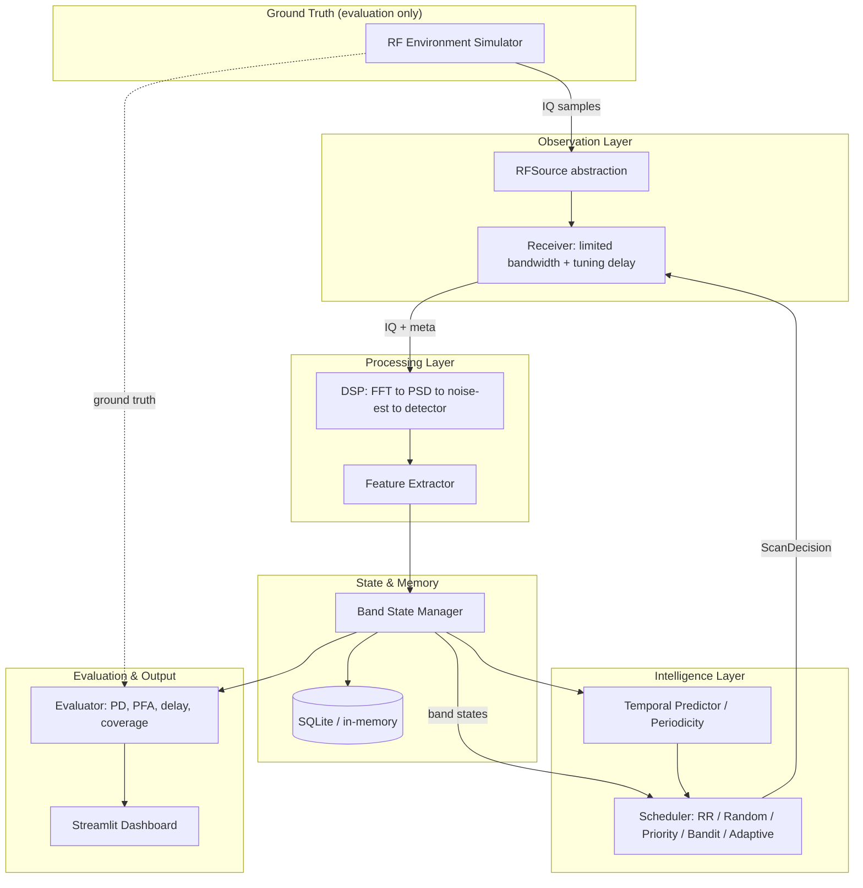

# Smart Adaptive Spectrum Scan & Signal Monitoring System

A complete, locally-runnable system for **adaptive scanning of a wide RF spectrum**
when there is little or no prior information about signal activity. A receiver whose
instantaneous bandwidth (e.g. 20 MHz) is far smaller than the total monitored
spectrum (e.g. 1000 MHz) must intelligently decide **where to look next**, balancing
exploration of unknown bands against exploitation of historically active ones.

Everything after acquisition is genuinely implemented: IQ ingestion, FFT/PSD,
noise estimation, energy detection, feature extraction, band-state tracking,
activity prediction, adaptive scheduling, online learning, evaluation, and a
dashboard. **No hardware is required** — the RF environment is simulated (or replayed
from recorded IQ files), and a real authorized receiver can be plugged in later via
the `RFSource` hardware-abstraction layer without touching the DSP, ML, or
scheduling code.

> **The detector never sees ground truth.** The scheduler infers activity purely
> from what it measures. Ground truth is available *only* to the evaluation
> subsystem, and automated tests enforce this separation.

---

## 1. Architecture



The **only** bridge across the information wall is `RFSource.read_samples()`, which
returns raw complex IQ and acquisition metadata — never labels.

---

## 2. Installation

Requires **Python 3.12+**.

```bash
cd smart-spectrum-scan
python3 -m venv .venv
source .venv/bin/activate        # Windows: .venv\Scripts\activate
pip install -e ".[dev]"
```

Or, without the editable install:

```bash
pip install -r requirements.txt
export PYTHONPATH=src             # so `import smartscan` works
```

---

## 3. Quick start

Run one scheduler against one scenario:

```bash
python scripts/run_experiment.py --scheduler adaptive --scenario periodic
python scripts/run_experiment.py --scheduler round_robin --scenario sparse --num-bands 100 --steps 1500
```

Benchmark every scheduler against every scenario (fair, seed-matched):

```bash
python scripts/benchmark_schedulers.py --num-bands 60 --steps 800 --seeds 1 2 3
```

Generate a recorded IQ dataset and confirm the same pipeline replays it:

```bash
python scripts/generate_dataset.py --scenario periodic --duration 2.0
```

Launch the dashboard:

```bash
streamlit run dashboard/app.py
```

---

## 4. How it works, step by step

Each scan step of the online loop:

1. **Scheduler decides** — picks a band from `BandState`s (observation-derived only)
   and emits a `ScanDecision(band_id, center_frequency, bandwidth, dwell_time, …)`.
2. **Receiver observes** — tunes (incurring `tuning_delay`), dwells (`dwell_time`),
   and returns complex IQ + `AcquisitionMeta`. Bandwidth is clamped to the receiver's
   instantaneous limit. The simulation clock advances.
3. **DSP + detection** — window → FFT → PSD (Welch/periodogram) → robust noise-floor
   estimate → adaptive threshold (`noise + margin`) → energy detection.
4. **State update** — the detection becomes a `BandObservation`; hit/miss counts,
   EWMA activity, running SNR, and confidence update.
5. **Reward + learning** — reward is computed from the **detection outcome** (not
   ground truth), and the scheduler updates online.
6. **Evaluation annotation** — *separately*, the evaluator queries ground truth to
   score the scan. This path never touches the scheduler.

---

## 5. Schedulers

| Scheduler | Idea |
|-----------|------|
| `round_robin` | Sequential sweep B0→B1→…→BN→B0 |
| `random` | Uniform random band selection |
| `priority` | `activity·w1 + recency·w2 + uncertainty·w3`, with anti-starvation |
| `bandit_ucb` | UCB1: mean reward + `c·√(ln N / n)` exploration bonus |
| `bandit_thompson` | Beta-Bernoulli Thompson Sampling |
| `adaptive` | **Contextual bandit (shared LinUCB)** over per-band feature vectors, plus periodicity-aware revisit bonus |

The adaptive scheduler learns a linear map from each band's feature context
(activity ratio, recency, confidence, SNR, …) to expected reward, so it generalizes
across bands and makes informed guesses about rarely-visited ones.

---

## 6. Metrics (definitions)

| Metric | Definition |
|--------|-----------|
| **PD** | correctly detected active opportunities / total active opportunities |
| **PFA** | false detections / inactive opportunities |
| **Scan hit rate** | scans with a detection / total scans |
| **Activity discovery ratio** | distinct activity events discovered / total events |
| **Avg / median / p95 discovery delay** | `detection_time − activity_start_time` |
| **Scan efficiency** | useful (true-positive) observations / total observations |
| **Band coverage** | bands visited at least once / total bands |
| **Starvation rate** | fraction of bands whose max revisit gap exceeds a threshold |
| **Precision / Recall / F1** | detector quality vs ground truth |
| **Average reward** | mean per-scan reward (detection-driven) |

The system carefully distinguishes **detector performance** (PD, PFA, F1) from
**scheduler performance** (discovery delay, efficiency, coverage, starvation).

---

## 7. Scenarios

`sparse`, `dense`, `periodic`, `random_burst`, `frequency_hopping`, `changing`
(statistics shift midway), `low_snr`, and `mixed`. All are reproducible from a seed
and used identically across schedulers for fair comparison.

---

## 8. Honest results

Actual output of `benchmark_schedulers.py --num-bands 60 --steps 800 --seeds 1 2 3`
(6 schedulers × 8 scenarios × 3 seeds = 144 runs), averaged across all scenarios:

| Scheduler | Discovery ratio | Scan efficiency | Avg discovery delay | Coverage | Avg reward |
|-----------|-----------------|-----------------|---------------------|----------|------------|
| **adaptive** | **1.00** | **0.71** | 0.564 s | 0.53 | **0.71** |
| bandit_thompson | 1.00 | 0.65 | 0.459 s | 1.00 | 0.65 |
| priority | 1.00 | 0.45 | 0.276 s | 1.00 | 0.45 |
| bandit_ucb | 1.00 | 0.26 | 0.273 s | 1.00 | 0.26 |
| round_robin | 0.86 | 0.08 | **0.260 s** | 1.00 | 0.08 |
| random | 0.84 | 0.09 | 0.269 s | 1.00 | 0.09 |

**What the adaptive scheduler wins:** scan efficiency (**8.5× round-robin**),
average reward, and it discovers **every** activity event (ratio 1.00) where
round-robin and random miss some (0.86 / 0.84). For a continuous-*monitoring*
mission — keep re-detecting activity — it is the clear winner.

**Where it does not win, reported truthfully:** round-robin has the **lowest average
discovery delay** (0.260 s vs adaptive's 0.564 s). *Why:* the learning schedulers
deliberately spend scans exploiting known-active bands, which delays first-discovery
of *new* events; a systematic sweep finds a fresh event faster on its next pass.
Adaptive also has lower **coverage** (0.53) because it concentrates on active bands
rather than visiting every band — a deliberate monitoring tradeoff, not a defect.

So the choice is mission-dependent: **adaptive/Thompson for efficient monitoring,
round-robin for minimum worst-case discovery latency.** No numbers here are
hand-picked — regenerate them with the command above; they land in
`data/results/benchmark_summary.csv` and `benchmark_ranking.csv`.

---

## 9. Recorded IQ files

Format: raw **complex64** binary (interleaved float32 I/Q) plus a JSON sidecar:

```json
{ "sample_rate": 20000000.0, "center_frequency": 100000000.0, "start_time": 0.0 }
```

`RecordedIQSource` reads these and feeds the **identical** DSP pipeline used for
simulated samples. Generate one with `scripts/generate_dataset.py`.

---

## 10. Future receiver abstraction

`RFSource` defines `read_samples / tune / get_sample_rate / get_center_frequency /
get_time`. Implementations: `SimulatedRFSource`, `RecordedIQSource`. An authorized
SDR (e.g. RTL-SDR, HackRF, USRP) can be added as a new `RFSource` **without changing**
the DSP, ML, or scheduling layers. This project implements **no** transmission,
jamming, targeting, or interception functionality.

---

## 11. Repository structure

```
smart-spectrum-scan/
├── config/            default.yaml, experiment.yaml, receiver.yaml
├── data/              recordings/ generated/ results/
├── src/smartscan/
│   ├── acquisition/   RFSource ABC, simulator + recorded-file sources
│   ├── simulation/    emitters, waveforms, noise, environment, scenarios
│   ├── receiver/      limited-bandwidth receiver model
│   ├── dsp/           fft, psd, noise_floor, energy detector
│   ├── features/      feature extraction
│   ├── state/         band state, history, SQLite database
│   ├── prediction/    periodicity estimation, predictors
│   ├── schedulers/    round_robin, random, priority, bandit, adaptive
│   ├── evaluation/    metrics, evaluator, experiment builder, benchmark
│   ├── visualization/ spectrum, timeline, metrics plots
│   └── utils/         logging, timing
├── dashboard/app.py   Streamlit dashboard
├── scripts/           run_experiment, benchmark_schedulers, generate_dataset
└── tests/             unit / integration / system
```

---

## 12. Testing

```bash
pytest                      # full suite
pytest tests/unit -q        # fast unit tests
pytest tests/integration    # pipeline + information-separation
pytest tests/system         # acceptance (slower: full multi-hundred-step runs)
```

Includes deterministic detection tests at multiple SNRs and explicit tests proving
the scheduler cannot access ground truth (no environment reference, no ground-truth
fields on `BandState` / `BandObservation` / `ScanDecision`).

---

## 13. Reproducibility

Every experiment records its configuration, seed, scheduler, scenario, and resulting
metrics (see the `config` field on `ExperimentResult` and the JSON written by
`run_experiment.py`). Given the same seed and config, runs are bit-for-bit
reproducible.

---

## 14. Limitations

- The simulator uses tone/band-limited-noise emitters, not full digital modulation
  (QAM/OFDM); the detector is energy-based, not cyclostationary or matched-filter.
- Discovery delay for always-on sources measures time-to-first-visit, so it is less
  discriminating than for bursty sources.
- Reward shaping is intentionally simple and configurable; it is not tuned per
  scenario.

## 15. Future extensions

- Cyclostationary / matched-filter detectors; wideband channelization.
- Q-learning / DQN sequential schedulers (scaffolding for research is isolated so it
  cannot delay the working baseline).
- Gradient-boosted or recurrent temporal predictors.
- Real SDR `RFSource` adapter for authorized monitoring.
```
